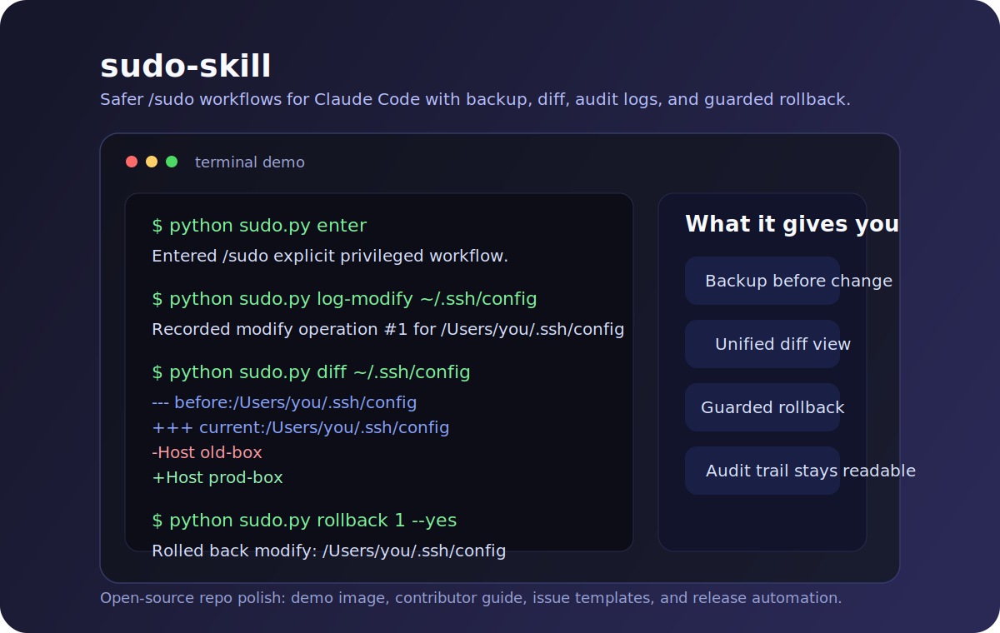

# sudo-skill

[](https://github.com/kelin3296-jpg/sudo-skill/actions/workflows/ci.yml)


A safer `/sudo` workflow for Claude Code — backup before change, diff before rollback, and a logged fallback path when privileged edits make users nervous.

中文说明见 [`README.zh-CN.md`](README.zh-CN.md). Want to contribute? Start with [`CONTRIBUTING.md`](CONTRIBUTING.md). Release history lives in [`CHANGELOG.md`](CHANGELOG.md).



## The story

The hard part of privileged edits is rarely the command itself. The real stress comes right after it:

- "If this change is wrong, how do I undo it without guessing?"
- "If I touch a sensitive path, do I still have a clear recovery path?"
- "If I use a `/sudo`-style workflow, am I creating extra cleanup work for myself later?"

`sudo-skill` exists to remove that hesitation. It keeps the familiar `/sudo` mental model, but turns it into an explicit, auditable workflow with backups, logs, diff inspection, and guarded rollback.

## Pain points it solves

- privileged edits feel high-stakes when shell history is the only breadcrumb
- risky file changes need a rollback story before they need a rollback command
- users want confidence, not just elevation
- the emotional cost of `/sudo` is often the fear of being stuck with a bad change

## What sudo-skill gives you

- **Explicit workflow**: `/sudo` means "tracked privileged workflow," not hidden sandbox bypass
- **Backup before change**: risky edits can be recovered from recorded state
- **Diff before rollback**: inspect first, revert second
- **Guarded rollback**: destructive rollback refuses to run when the file object no longer matches
- **Auditable trail**: backups and logs stay readable under `~/.claude`

## The fallback path when something feels wrong

If a privileged change introduces doubt, the recovery plan is not guesswork:

1. inspect `/sudo diff`
2. review `/sudo history`
3. roll back the newest active change when object validation still matches
4. inspect `~/.claude/sudo-backups/` and `~/.claude/sudo-logs/` if manual recovery is needed

That is the real promise of this skill: it reduces the after-the-fact anxiety around privileged mode because the user knows there is a logged, reversible path out.

## Install in 30 seconds

### Fastest path: paste this into Claude Code

```text
Please install the GitHub skill from https://github.com/kelin3296-jpg/sudo-skill

Requirements:
1. Download the latest GitHub Release asset named `sudo-skill.zip`
2. Install it to `~/.claude/skills/sudo`
3. If `~/.claude/skills/sudo` already exists, back it up before replacing it
4. Run `python3 ~/.claude/skills/sudo/sudo.py status` after installation
5. Then explain how to use `/sudo`, `/sudo diff`, `/sudo history 5`, and `/sudo rollback 1 --yes`
6. If the release asset is unavailable, fall back to installing from the repository contents and tell me which path you used
```

### Manual fallback install

```bash
mkdir -p ~/.claude/skills
curl -L -o /tmp/sudo-skill.zip   https://github.com/kelin3296-jpg/sudo-skill/releases/latest/download/sudo-skill.zip

tmp_dir=$(mktemp -d)
unzip /tmp/sudo-skill.zip -d "$tmp_dir"

if [ -d ~/.claude/skills/sudo ]; then
  mv ~/.claude/skills/sudo ~/.claude/skills/sudo.bak.$(date +%Y%m%d%H%M%S)
fi

mv "$tmp_dir"/sudo-skill ~/.claude/skills/sudo
python3 ~/.claude/skills/sudo/sudo.py status
```

## Quick start

```bash
python sudo.py enter
python sudo.py log-modify ~/.ssh/config
# edit the file
python sudo.py finalize-modify ~/.ssh/config
python sudo.py diff ~/.ssh/config
python sudo.py rollback 1 --yes
python sudo.py exit
```

## Public commands

```bash
python sudo.py enter
python sudo.py exit
python sudo.py status
python sudo.py clean --days 7
python sudo.py purge --yes
python sudo.py history 20
python sudo.py rollback 1 --yes
python sudo.py diff [path|history-index]
```

## Integrator commands used by the skill

These commands keep `operation_logger.py` internal while still letting the skill track changes via the public CLI:

```bash
python sudo.py log-modify <path>
python sudo.py finalize-modify <path> [--id OP_ID]
python sudo.py log-delete <path>
python sudo.py log-create <path>
python sudo.py log-move <src> <dst>
python sudo.py log-chmod <path> <old_mode_octal> <new_mode_octal>
```

## Storage

By default the skill stores state under `~/.claude`:

- `~/.claude/sudo-backups/`
- `~/.claude/sudo-logs/`
- `~/.claude/sudo-state.json`

Set `SUDO_SKILL_HOME` to isolate development, testing, or custom installations.

## Safety notes

- The skill does **not** automatically elevate Claude Code commands.
- Rollback refuses destructive actions if the tracked file object no longer matches the recorded snapshot.
- `delete` rollback refuses to overwrite a path that has been reused.
- `create` rollback refuses to delete a file that changed after creation.

## Demo walkthrough

```text
$ python sudo.py enter
Entered /sudo explicit privileged workflow.

$ python sudo.py log-modify ~/.ssh/config
Recorded modify operation #1 for /Users/you/.ssh/config

$ python sudo.py finalize-modify ~/.ssh/config
Finalized modify operation #1 for /Users/you/.ssh/config

$ python sudo.py diff ~/.ssh/config
--- before:/Users/you/.ssh/config
+++ current:/Users/you/.ssh/config
@@ ...

$ python sudo.py rollback 1 --yes
Rolled back modify: /Users/you/.ssh/config

$ python sudo.py exit
Exited /sudo workflow.
```

## Project docs

- Contributor guide: [`CONTRIBUTING.md`](CONTRIBUTING.md)
- Changelog: [`CHANGELOG.md`](CHANGELOG.md)
- Security policy: [`SECURITY.md`](SECURITY.md)
- Support guide: [`SUPPORT.md`](SUPPORT.md)
- Bug reports: GitHub issue template
- Feature requests: GitHub issue template
- Pull requests: GitHub PR template

## Development

```bash
python3 -m venv .venv
./.venv/bin/pip install pytest
./.venv/bin/python -m pytest
python3 scripts/build_release.py
```

The release builder creates `dist/sudo-skill.zip` without `__MACOSX`, tests, or cache files.

Tags like `v0.1.0` trigger `.github/workflows/release.yml` to run tests, build the zip, and publish a GitHub Release with structured notes.

If you publish this repository under a different GitHub owner or repo name, update the badge URLs at the top of this file.
